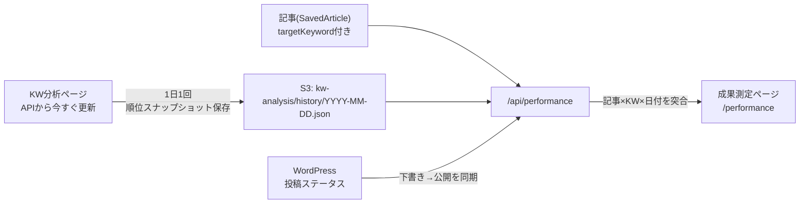

# 成果測定ページ 移植設計書（RAS → NAS）

このドキュメントは、RASプロジェクトの「成果測定ページ」をNASプロジェクトに移植するための指示設計書です。
NASをOpen folderで開き、Agentモードでこのファイルの内容を貼り付ければ、そのまま実装を進められるように書いています。

---

## 0. この機能が何をするか（概要）

公開した記事の「対象キーワード（targetKeyword）」が、Ahrefsで取得した自社流入キーワードの中で
**公開日からの経過日数に対して検索順位がどう変化したか**を折れ線グラフで追跡するページです。




ポイント:

- **順位の生データはAhrefs API（Site Explorer > organic-keywords）**。RAS/NAS自前で順位を測らない。
- KW分析ページの「APIから今すぐ更新」を実行するたびに、その日の自社流入KWの順位を
**日付付きスナップショットとしてS3に追記保存**していく（これが時系列データの源泉）。
- 成果測定ページは「記事のtargetKeyword」と「スナップショット内のkeyword」を正規化して突合し、
公開日を起点(0日目)とした経過日数×順位のグラフを作る。

---

## 1. 前提：NAS側で既に存在するはずの依存

移植前に、NASに以下が揃っているか確認すること（RASと同じ構成のはず）。無ければ先に用意する。


| 依存                | 役割                 | RASでの場所                                                                                                     |
| ----------------- | ------------------ | ----------------------------------------------------------------------------------------------------------- |
| S3ユーティリティ         | S3読み書き             | `src/lib/s3Reference.ts`（`listS3Objects` / `getS3ObjectAsText` / `getS3ObjectsAsTextBatch` / `putS3Object`） |
| Ahrefs API クライアント | organic-keywords取得 | `src/lib/ahrefsApi.ts`（`fetchOrganicKeywords`）                                                              |
| Ahrefsデータ型        | データセット型            | `src/lib/ahrefsCsvParser.ts`（`AhrefsDataset` / `AhrefsKeywordRow`）                                          |
| 記事型               | 記事データ              | `src/lib/types.ts`（`SavedArticle`）                                                                          |
| WordPressクライアント   | 投稿・ステータス取得         | `src/lib/wordpress.ts`                                                                                      |
| Ahrefs取得API       | KW取得＋S3保存          | `app/api/ahrefs/fetch/route.ts`                                                                             |


> NASは対象ドメイン・ブランド名・KWセットが異なるので、`AHREFS_TARGET_DOMAIN` などの環境変数と
> シードKWはNAS向けに読み替えること。ロジック自体はドメイン非依存。

### 必要な環境変数（NASの.env / Vercel）

```
AHREFS_API_KEY           … Ahrefs APIキー
AHREFS_TARGET_DOMAIN     … NASの対象ドメイン（例: nas-example.co.jp）
AHREFS_COUNTRY           … jp（省略可）
AHREFS_API_MAX_ROWS      … organic取得の最大行数（例: 100）
WORDPRESS_URL / WORDPRESS_USERNAME / WORDPRESS_APP_PASSWORD  … WP投稿・ステータス取得
WORDPRESS_POST_TYPE      … 投稿タイプ（RASは 'column'。NASの投稿タイプに合わせる）
```

---

## 2. S3のデータ構造（キー設計）

```
articles/{id}.json                     … SavedArticle（記事本体）
kw-analysis/index.json                 … データセットのメタ一覧（DatasetMeta[]）
kw-analysis/datasets/{id}.json         … AhrefsDataset本体（最新のみ、更新で置換）
kw-analysis/history/{YYYY-MM-DD}.json  … ★成果測定の心臓部。日次の順位スナップショット（追記・削除しない）
```

### 順位スナップショットの形（`kw-analysis/history/2026-07-15.json`）

```ts
interface HistorySnapshot {
  date: string          // "2026-07-15"（JSTのその日）
  fetchedAt: string     // ISO日時
  domain?: string
  country?: string
  keywords: {
    keyword: string
    position: number | null   // 検索順位（1が最上位）
    volume: number
    traffic: number | null    // 推定流入
    url: string
  }[]
}
```

---

## 3. 実装ステップ

### ステップ1: Ahrefs取得APIに「順位履歴スナップショット保存」を追加

**対象**: NASの `app/api/ahrefs/fetch/route.ts`（RASと同等のファイル）

organic KW取得後、`kw-analysis/history/{date}.json` にその日のスナップショットを保存する処理を追加する。
**データセット本体（datasets/）は毎回置換されるが、history/ は日付ごとに残し続ける**のが肝。

RASの該当コード（これをNASの同じ位置に追加する）:

```ts
const HISTORY_PREFIX = `${PREFIX}history/`  // PREFIX = 'kw-analysis/'

// ... organicRows を取得し index を保存した後 ...

// 成果測定用: 自社流入KWの順位スナップショットを日付キーで蓄積する。
if (organicRows.length > 0) {
  const snapshot = {
    date,                    // now.slice(0, 10)
    fetchedAt: now,
    domain,
    country,
    keywords: organicRows.map(row => ({
      keyword: row.keyword,
      position: row.position,
      volume: row.volume,
      traffic: row.currentTraffic,
      url: row.url,
    })),
  }
  // 同日に複数回更新した場合は最新で上書き（1日1スナップショット）
  await putS3Object(`${HISTORY_PREFIX}${date}.json`, JSON.stringify(snapshot))
}
```

> これが無いと時系列が蓄積されず、グラフは常に1点しか描けない。**最初に必ず入れる。**

---

### ステップ2: WordPressステータス同期関数を追加

**対象**: NASの `src/lib/wordpress.ts`

「RASからは下書き送信だが、WP管理画面で直接公開された」記事を成果測定に載せるための関数。
スラッグでWPに問い合わせて現在の投稿ステータスを取得する。

```ts
export interface WordPressPostStatusResult {
  status: string;
  link: string;
}

/**
 * スラッグからWordPress側の現在の投稿ステータスを取得する。
 * status=publish,future,draft,pending,private を含めて問い合わせるため認証必須。
 */
export async function fetchWordPressPostStatusBySlug(slug: string): Promise<WordPressPostStatusResult | null> {
  const trimmedSlug = slug.trim();
  if (!trimmedSlug) return null;

  const wpUrl = process.env.WORDPRESS_URL?.trim();
  const username = process.env.WORDPRESS_USERNAME?.trim();
  const appPassword = process.env.WORDPRESS_APP_PASSWORD?.trim();
  if (!wpUrl || !username || !appPassword) return null;

  const postType = process.env.WORDPRESS_POST_TYPE?.trim() || 'posts'; // NASの投稿タイプに合わせる
  const credentials = Buffer.from(`${username}:${appPassword}`).toString('base64');
  const url = `${wpUrl}/wp-json/wp/v2/${postType}?slug=${encodeURIComponent(trimmedSlug)}&status=publish,future,draft,pending,private&context=edit&per_page=1`;

  try {
    const res = await fetch(url, {
      headers: { Authorization: `Basic ${credentials}` },
      cache: 'no-store',
    });
    if (!res.ok) return null;
    const data = (await res.json().catch(() => null)) as Array<{ status?: string; link?: string }> | null;
    const post = data?.[0];
    if (!post?.status) return null;
    return { status: post.status, link: post.link ?? '' };
  } catch {
    return null;
  }
}
```

> NASでWP直接公開を追跡しないなら、この関数と後述の `syncPublishStatusFromWordPress` は省略可。
> ただしRASでは「クライアントが下書き確認後にWP側で公開する」運用のため必須だった。

---

### ステップ3: 成果測定APIルートを新規作成

**新規**: NASの `app/api/performance/route.ts`

RASの実装をほぼそのまま流用する（下記が完全版のロジック）。処理の流れ:

1. `articles/` 配下の全 `SavedArticle` を並列取得
2. `kw-analysis/history/` の全スナップショットを取得（直近120件まで）
3. 履歴が無い場合の救済：最新の organic データセットを1点だけ疑似スナップショットとして補完
4. WordPress同期（下書き→公開に変わった記事のstatusを更新しS3へ書き戻し）
5. 各記事について、targetKeywordを正規化してスナップショット群と突合し、
  公開日起点の経過日数×順位の時系列(`series`)を構築
6. 順位が良い順にソートして返す。記事に紐付かない流入KWも別枠で返す

**判定ロジックの要点（NAS移植時に読み替える箇所）**:

- `isTrackable`: 追跡対象＝「targetKeywordがある」かつ「`status==='published'` または `wordpressPostStatus` が `publish`/`future`」。
`**wordpressUrl` の有無で判定してはいけない**（下書きでもURLは発行されるため）。
- `publishedDate`: `scheduledDate`（予約日）優先、無ければ `createdAt`。日付は `slice(0,10)`。
- `normalizeKeyword`: `trim().toLowerCase().replace(/\s+/g, ' ')`。記事KWとスナップショットKWを同じ関数で正規化して突合。
- `daysBetween`: UTC 0時基準で日数差。公開前(day<0)のスナップショットは除外。
- `positionChange`: `firstPosition - latestPosition`（正=改善、負=悪化）。

RASの完全なソースは `app/api/performance/route.ts` を参照（このリポジトリ内）。以下の定数だけNAS向けに確認:

```ts
const ARTICLES_PREFIX = 'articles/'
const KW_PREFIX = 'kw-analysis/'
const HISTORY_PREFIX = `${KW_PREFIX}history/`
const INDEX_KEY = `${KW_PREFIX}index.json`
const MAX_SNAPSHOTS = 120
export const maxDuration = 60  // WP同期を並列問い合わせするため延長
```

**APIレスポンスの型（フロントと共有）**:

```ts
interface PerformancePoint {
  date: string
  day: number              // 公開日からの経過日数
  position: number | null
  traffic: number | null
}
interface PerformanceArticle {
  id: string
  title: string
  targetKeyword: string
  publishedDate: string
  wordpressUrl?: string
  status: string
  volume: number
  series: PerformancePoint[]
  firstPosition: number | null
  latestPosition: number | null
  bestPosition: number | null
  positionChange: number | null   // 正=改善
}
// GET /api/performance のレスポンス
{
  snapshots: { date: string; keywordCount: number }[]
  articles: PerformanceArticle[]
  unmatchedKeywords: { keyword: string; position: number|null; volume: number; traffic: number|null; url: string }[]
}
```

---

### ステップ4: 成果測定ページ（フロント）を新規作成

**新規**: NASの `app/performance/page.tsx`

`'use client'` コンポーネント。`/api/performance` をfetchして描画する。構成要素:

1. **ヘッダー**: タイトル「成果測定」＋説明文＋「更新」ボタン（再fetch）
2. **案内ボックス**: 「順位データはKW分析の『APIから今すぐ更新』を実行するたびに蓄積される」旨と現在の蓄積回数
3. **サマリーカード3枚**: 「追跡対象の記事数」「順位計測中(latestPositionあり)」「順位が改善(positionChange>0)」
4. **記事ごとのカード**（記事数分ループ）:
  - タイトル / WPリンク / KW / Vol / 公開日 / 経過日数
  - 最新順位（大きく表示）＋ ChangeBadge（改善/悪化/変動なし）
  - `latestPosition != null` なら `PositionChart`（自作SVG折れ線）、無ければ「圏外」表示
5. **記事と未紐付けの流入KWテーブル**: `unmatchedKeywords` を表示（対象KW設定を促す）

**PositionChart（自作SVG折れ線グラフ）の仕様**:

- ライブラリ不使用。`<svg viewBox="0 0 560 150">` に手描き。
- 横軸=経過日数（`p.day`、最小〜最大でスケール）、縦軸=順位（**1位が上**。`y = PAD.top + ((pos-1)/(yMax-1))*innerH`）。
- yMaxは実測最大順位を10単位で切り上げ。10位刻みのグリッド線＋「N位」ラベル。
- 折れ線は `position != null` の点のみ。各点に `<title>` でツールチップ（日付・経過日数・順位・推定流入）。

RASの完全なソースは `app/performance/page.tsx` を参照（`PositionChart`関数と`ChangeBadge`関数を含めそのまま流用可能）。
NASのカラーテーマに合わせて色コード（`#009AE0`等）を調整すること。

---

### ステップ5: サイドバー／ナビゲーションにリンク追加

**対象**: NASのレイアウト（RASは `app/LayoutWithSidebar.tsx`）

ナビゲーション配列に `{ href: '/performance', label: '成果測定' }` を追加する。

---

## 4. 動作の前提と運用フロー（NAS利用者への説明用）

1. 記事を作成し、必ず **targetKeyword** を設定してWordPressに公開（または予約公開）する。
2. **KW分析ページで「APIから今すぐ更新」を定期実行**する（理想は毎日1回）。
  これを実行するたびに順位スナップショットが1日分蓄積される。
3. 成果測定ページを開くと、公開済み記事の対象KWがAhrefsの自社流入KWに現れていれば、
  公開日からの経過日数×順位の折れ線が描かれる。
4. まだ順位圏外のKWは「圏外」と表示され、順位がつき始めると自動でグラフ化される。

**重要な制約**:

- スナップショットは「APIから今すぐ更新」を押した回数分しか貯まらない。押さない日はデータが飛ぶ（グラフは実行日だけプロット）。
→ NASでも定期実行を習慣化するか、cronで `/api/ahrefs/fetch` を叩く仕組みを別途検討するとよい。
- Ahrefsの organic-keywords は自社ドメインが**実際に順位を持っているKWのみ**返す。
記事を公開しても順位がつくまでは履歴に現れない（＝グラフは公開後しばらく空）。
- Ahrefs API はユニット課金。更新頻度と `AHREFS_API_MAX_ROWS` に注意。

---

## 5. 突合ロジックの数式まとめ（因数・変数）


| 変数               | 取得元          | 計算                                                         |
| ---------------- | ------------ | ---------------------------------------------------------- |
| `publishedDate`  | SavedArticle | `scheduledDate                                             |
| `day`（経過日数）      | 記事×スナップショット  | `daysBetween(publishedDate, snapshot.date)`（UTC 0時基準、負は除外） |
| `position`       | スナップショット     | KW正規化一致した行の `position`                                     |
| `traffic`        | スナップショット     | 同上の `traffic`                                              |
| `volume`         | スナップショット     | 一致行の `volume` の最大値                                         |
| `firstPosition`  | series       | 順位が付いた最初の点                                                 |
| `latestPosition` | series       | 順位が付いた最後の点                                                 |
| `bestPosition`   | series       | 順位が付いた点の最小値（＝最高順位）                                         |
| `positionChange` | series       | `firstPosition - latestPosition`（正=改善）                     |


KW突合キー: `keyword.trim().toLowerCase().replace(/\s+/g, ' ')`（記事側・スナップショット側で同一関数）

---

## 6. 移植チェックリスト

- `app/api/ahrefs/fetch/route.ts` に history スナップショット保存を追加（ステップ1）
- `src/lib/wordpress.ts` に `fetchWordPressPostStatusBySlug` 追加（ステップ2・WP直接公開を追う場合）
- `app/api/performance/route.ts` 新規作成（ステップ3）
- `app/performance/page.tsx` 新規作成（ステップ4）
- サイドバーに `/performance` リンク追加（ステップ5）
- 環境変数（AHREFS_*, WORDPRESS_*）がNAS向けに設定済みか確認
- `WORDPRESS_POST_TYPE` をNASの投稿タイプに読み替え
- `isTrackable` の判定・シードKW・ブランド語などNAS固有部分を読み替え
- `npx tsc --noEmit` と `npx next build` が通ることを確認
- KW分析で1回「APIから今すぐ更新」→ 成果測定ページで蓄積回数が1になることを確認

```

```

